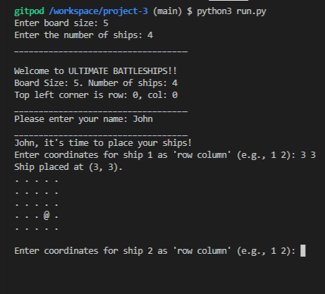
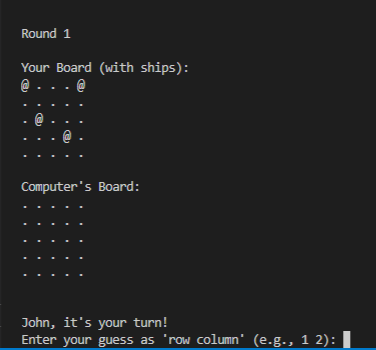
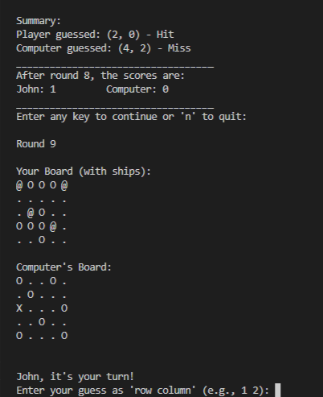

# ULTIMATE Battleships
Battleships, also known simply as Battleship, is a classic two-player strategy game that blends deduction, tactics, and a touch of luck. Originating as a pencil-and-paper game during World War I, it has since evolved into a popular board game, digital adaptation, and mobile app enjoyed by players of all ages worldwide.

## Game Overview

In this Battleships, the player commands a fleet of ships strategically placed on a grid. The objective is to locate and "sink" the opponent’s fleet, in this case, the computer by guessing it's ships positions through a series of targeted strikes. The game involves strategic thinking as player must conceal his/her ships placement while trying to discover and destroy his/her opponent’s.

## Why should you play the battleship game?
Battleships is more than just a game-it's a test of strategy, anticipation, and patience. Its simplicity makes it accessible, while its depth keeps players coming back for more. Whether played on paper, a game board, or digitally, it remains an enduring favorite in family game nights and competitive play.

Are you ready to command your fleet and outmaneuver your opponent? Let the battle begin!

- [Introduction](#introduction)
- [Project](#project)
  - [Ultimate Battleships Game - User Goals](#Ultimate-Battleships-Game---User-Goals)
  - [Ultimate Battleships Game - Site Owner Goals](#Ultimate-Battleships-Game---Site-Owner-Goals)
- [Pre development](#pre-development)
- [Development](#development)
- [Features](#features)

- [Technologies Used](#technologies-used)
- [Resources](#resources)
  - [Libraries](#libraries)
- [Testing](#testing)
- [Future Updates](#future-updates)  
- [Validation](#validation)
- [Deployment](#deployment)
  - [Heroku](#heroku)
  - [Branching the GitHub Repository using GitHub Desktop and Visual Studio Code](#branching-the-github-repository-using-github-desktop-and-visual-studio-code)
- [Bugs](#bugs)
- [Credits](#credits)
- [Acknowledgements](#acknowledgements)

## Introduction

Welcome to the Ultimate Battleships Game! This is a console-based implementation of the classic game of Battleship where a player competes against a computer opponent. The game involves placing ships on a grid and then taking turns to guess the location of each other's ships.

## Project 

## Ultimate Battleships Game - User Goals

### Entertainment and Engagement
- Enjoy a fun, strategic gameplay experience.
- Have an intuitive and seamless user interface.
- Experience a fair and balanced game.

### Competitive Play
- Challenge friends or random opponents the computr in this case.
- Improve skills through repeated play and strategizing.
- Track wins, losses, and rankings.

### Ease of Access
- Access the game easily on multiple platforms (desktop, mobile, or tablet).
- Play without needing extensive instructions or tutorials.

### Customization
- Personalize the game board, ships, and other visual elements.
- Select difficulty levels or specific rulesets.

## Ultimate Battleships Game - Site Owner Goals

### User Retention and Engagement
To ensure long-term user retention and engagement.

### Monetization
Monetizing the game effectively is essential for sustainability.

### Community Growth
Fostering a robust community will help drive traffic and promote user loyalty.

### Data Collection
Leveraging user data (with appropriate legal considerations) to improve the game experience.

### Brand Building
Building a strong brand is vital for attracting and retaining users.

### Scalability
Preparing for future growth is essential to accommodate more users.

## Pre development

### Development

Code was written for each part of the program starting with the header and input for contractors to add their name. Once each section was working the development of the following section took place. Once all sections had been created testing took place which highlighted the need for additional features.

i.e.
In the "input name" section the user could hit enter and a blank space would be inputted so the first and last names were made required fields. Instructions were written to ensure each user understood the importance of entering their name only. After testing with required fields, the inability to add symbols and numbers was also added.

In the "input dates and hours" section testing highlighted the fact that a customer can enter that they worked for just one day but worked 36 hours. Additional coding was added to ensure the maximum number of hours worked in a day was 13 and that applied whether a user worked one day or 10.

## Features

1. Manual placement of ships by player.
   

3. Random board generation for computer and player cannot see where the computer's ships are.
   

5. Accepts user inputs and gives saummary of scores after each round
   

7. Input validation for
   
- Numbers out fo board's range
- Check whether inputs are numbers
- Checks whether the same coordinates are given more than once
  

### What the portal checks

A name is inputted and not left blank. Instructions are given to only use letters to avoid a delay in payment.

Profession is chosen from a list of options

The dates (must be within a two month period), the total number of days and hours worked.

As per Working Time Regulations 1998 a maximum of 13 hours are allowed in a day. App checks that less than 13 hours is inputted per day.

Hours can not exceed the dates.

Based on information provided a calculation is made to determine pay before tax and then pay after tax and NI deductions.

The program checks that the contractor is ready to submit this information. 

If they select yes, they receive confirmation of submission

If they select no, they are invited to re-submit, as shown above.

### Error Page

A 404 error page has been included. The html was run through the W3C html validator and errors removed. A css style file was created to support the display of the text on the page.

## Google Sheets

Using Google sheets wasn't part of the original project spec and was added after all the code was created, tested and working. The sheet contains two sections

### Payments
In this area the following contractor information is included:

- First name
- Last name
- Profession
- Start date
- End date
- Pay before tax

### Tax
In this area the following contractor information is included:

- First name
- Last name
- Profession
- Pay before tax
- Tax to pay
- National Insurance to pay

This information is sent to the umbrella company.

## Technologies Used

The main technology used to create this program is Python
HTML and CSS to change the background and add social media links.
Google API
Google Sheets

### Resources

- Codeanywhere 
- Visual Studio Code (VSC)
- GitHub 
- Heroku
- Font Awesome
- Canva for help with images
- miro.com to create flow chart

### Libraries
[colorama Fore & Back](https://pypi.org/project/colorama/)
[random](https://docs.python.org/3/library/random.html) - to generate contractor number
[typing](https://www.101computing.net/python-typing-text-effect/))
[datetime](https://www.programiz.com/python-programming/datetime)
[sleep](https://www.programiz.com/python-programming/time/sleep) - function for delays in typing out lines

## Testing

The portal has been well tested and the results can be viewed [here - TESTING](https://github.com/todiane/corri-construction-p3/blob/main/TESTING.md)

## Future Updates

The next update of the app will include the option to choose whether it is their first visit (which will show the instructions) or whether they have used the service before - which will show the instructions behind a button.

The ability for a manager to log into the system and confirm working dates and days for each contractor all in one place rather than via separate emails.

Relevant information is accessible by the umbrella company so that HR doesn't have to collate and forward this information.

Other future updates are included in the TESTING.md file.

## Validation

PEP8 - Python style guide checker imported - https://pypi.org/project/pep8/
All code validated and where lines were showing as too long they were adjusted. Some line adjustments caused bugs in the code and it stopped working so they were left as longer lines to avoid this issue. pycodestyle . - was used in Codeanywhere terminal to list any issues.

## Deployment

### Heroku

The Application has been deployed from GitHub to Heroku by following the steps:

1. Create or log in to your account at heroku.com
2. Create a new app, add a unique app name ( for example corri-construction-p3) and then choose your region
3. Click on create app
4. Go to "Settings"
5. Under Config Vars add the private API key information using key 'CRED' and into the value area copy the API key information added to the .json file.  Also add a key 'PORT' and value '8000'.
6. Add required buildpacks (further dependencies). For this project, set it up so Python will be on top and Node.js on bottom
7. Go to "Deploy" and select "GitHub" in "Deployment method"
8. To connect Heroku app to your Github repository code enter your repository name, click 'Search' and then 'Connect' when it shows below.
9.  Choose the branch you want to build your app from
10. If preferred, click on "Enable Automatic Deploys", which keeps the app up to date with your GitHub repository
11. Wait for the app to build. Once ready you will see the “App was successfully deployed” message and a 'View' button to take you to your deployed link.

### Branching the GitHub Repository using GitHub Desktop and Visual Studio Code
1. Go to the GitHub repository.
2. Click on the branch button in the left hand side under the repository name.
3. Give your branch a name.
4. Go to the CODE area on the right and select "Open with GitHub Desktop".
5. You will be asked if you want to clone the repository - say yes.
6. GitHub desktop will suggest what to do next - select Open code using Visual Studio Code.
   
The deployed project live link is [HERE](https://corri-construction-8c4725a33281.herokuapp.com/) - ***Use Ctrl (Cmd) and click to open in a new window.*** 

## Bugs

After importing the type element so that text can be typed out a line at a time the codes for Fore.WHITE or bold kept showing up e.g. '\033[1m' for bold was typed out. To fix this I had to remove - colorama.init(autoreset=True) - which  meant I had to go through each line of code to ensure if one line was red, all subsequent lines didn't turn red. 

## Credits

Free Code Camp Python for everyone course that helped me get my project started - [here](https://www.youtube.com/watch?v=wgkC8SxraAQ)

py4e autograder to help with checking maths - [here](https://www.py4e.com/tsugi/store/test/pythonauto )

Geek for Geek to help me use strip() to add required field for first/last name - [here](https://www.geeksforgeeks.org/python-program-to-check-if-string-is-empty-or-not/)

Help putting together the function that calculates income tax and national insurance I started with this video and adapted it - [here](https://www.youtube.com/watch?v=b4lok6-_GGg )

To change numerical value to end in two figures only - [here](https://tutorial.eyehunts.com/python/how-to-display-2-decimal-places-in-python-example-code/)

Using colorama import - [here](https://www.youtube.com/watch?v=u51Zjlnui4Y )

Being able to bold and center font - taken from w3Schools - [here](https://www.w3schools.com/python/ref_string_center.asp)

## Acknowledgements

## Contents
1. [User Experience (UX)](#user-experience-ux)
    - [Initial Discussion](#initial-discussion)
    - [User Stories](#user-stories)
2. [Design](#design)
    - [Colour Scheme](#colour-scheme)
    - [Typography](#typography)
    - [Imagery](#imagery)
    - [Wireframes](#wireframes)
3. [Features](#features)
    - [Accessibility](#accessibility)
4. [Technologies Used](#technologies-used)
    - [Languages Used](#languages-used)
    - [Frameworks, Libraries & Programs Used](#frameworks-libraries-programs-used)
5. [Deployment & Local Development](#deployment-local-development)
    - [Deployment](#deployment)
    - [Local Development](#local-development)
        - [How to Fork](#how-to-fork)
        - [How to Clone](#how-to-clone)
6. [Testing](#testing)   
    - [Solved Bugs](#solved-bugs)
    - [Known Bugs](#known-bugs)
    - [Testing User Stories](#testing-user-stories)   
    - [Thank You Page](#thank-you-page)
    - [Full Testing](#full-testing)
7. [Credits](#credits)
    - [Code Used](#code-used)
    - [Content](#content)
    - [Media](#media)
    - [Acknowledgments](#acknowledgments)

---

## User Experience (UX)

### Initial Discussion
The Battleship Game is a text-based interactive experience where the player competes against a computer. The primary goal is to create an engaging yet straightforward gameplay experience while maintaining functionality and usability.

### User Stories
1. As a user, I want a clear and intuitive grid-based board for gameplay.
2. As a user, I want responsive feedback on my actions (e.g., hits and misses).
3. As a user, I want a seamless flow of turns and easy-to-understand instructions.
4. As a user, I want to track scores and understand the outcome of the game.

## Design

### Colour Scheme
Since this is a text-based game, the visual elements focus on ASCII characters. 
- Symbols like `.` for empty spaces, `@` for ships, `X` for hits, and `O` for misses provide clarity.

### Typography
- Monospaced fonts are ideal for aligning the grid structure.

### Imagery
- No images are used; ASCII characters ensure cross-platform compatibility.

### Wireframes
- Text-based representation of the game board and turn prompts.

## Features

1. Manual placement of ships by player.
   

2. Random board generation for computer and player cannot see where the computer's ships are.
   

3. Accepts user inputs and gives saummary of scores after each round
   

4. Input validation for 
- Numbers out fo board's range
- Check whether inputs are numbers
- Checks whether the same coordinates are given more than once
  

## Key Features
1. Strategic Placement: Players must carefully position their ships to maximize defense while minimizing predictability.
2. Deductive Reasoning: Every missed or successful shot brings new information, challenging players to think critically and outwit their opponent.
3. Simple Yet Engaging: The rules are straightforward, but the gameplay offers endless strategic depth and replayability.

### Accessibility
- Keyboard-only interaction ensures the game is accessible for users with visual impairments when paired with screen readers.
- Clear and concise text-based instructions.

## Technologies Used

### Languages Used
- Python

### Frameworks, Libraries & Programs Used
1. Python Standard Library
2. Heroku for deployment to the server.
3. PEP8 Python Validator for Python Code Validation.

## Deployment & Local Development

## Deployment

### Heroku

The Application has been deployed from GitHub to Heroku by following the steps:

1. Create or log in to your account at heroku.com
2. Create a new app, add a unique app name ( for example corri-construction-p3) and then choose your region
3. Click on create app
4. Go to "Settings"
5. Under Config Vars add the private API key information using key 'CRED' and into the value area copy the API key information added to the .json file.  Also add a key 'PORT' and value '8000'.
6. Add required buildpacks (further dependencies). For this project, set it up so Python will be on top and Node.js on bottom
7. Go to "Deploy" and select "GitHub" in "Deployment method"
8. To connect Heroku app to your Github repository code enter your repository name, click 'Search' and then 'Connect' when it shows below.
9.  Choose the branch you want to build your app from
10. If preferred, click on "Enable Automatic Deploys", which keeps the app up to date with your GitHub repository
11. Wait for the app to build. Once ready you will see the “App was successfully deployed” message and a 'View' button to take you to your deployed link.

### Branching the GitHub Repository using GitHub Desktop and Visual Studio Code
1. Go to the GitHub repository.
2. Click on the branch button in the left hand side under the repository name.
3. Give your branch a name.
4. Go to the CODE area on the right and select "Open with GitHub Desktop".
5. You will be asked if you want to clone the repository - say yes.
6. GitHub desktop will suggest what to do next - select Open code using Visual Studio Code.

### Local Development

#### How to Fork
1. Navigate to the repository on GitHub.
2. Click on the "Fork" button to create a copy in your account.

#### How to Clone
1. Copy the repository URL.
2. Run `git clone <repository-url>` in your terminal.

## Testing

### Solved Bugs
- Resolved issues with ship placement validation.
- Fixed an infinite loop in random guess generation.

### Known Bugs
- Rare edge cases where the computer might repeat guesses.

### Testing User Stories
- Verified intuitive gameplay and clear turn prompts.
- Ensured accurate score tracking and endgame conditions.

### Thank You Page
- Thank you Code Institute technical staff for tutoring, mentoring, and student care.

### Full Testing
- Conducted playthroughs to confirm all functionalities, including edge cases and invalid inputs.

## Credits
- Code Institute Portfolio 3: Project Submission lesson  for using the set-up code for the Ultimate Battleship game.

### Code Used
- Random number generation and validation logic for ship placement were inspired by standard Python documentation.

### Content
- Game rules based on the classic Battleship board game.

### Media
- No media used.

### Acknowledgments
- Special thanks to Code Institute for giving me the opportunity to learn as a full stack software development.
