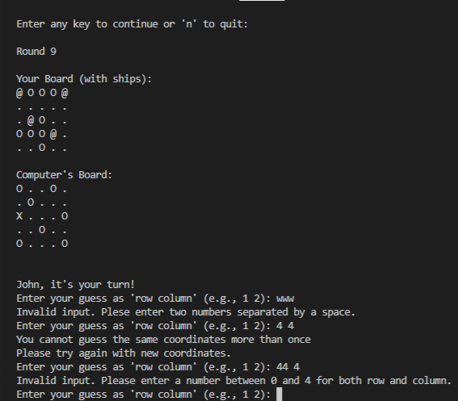

## Features

1. Manual placement of ships by player.
   

2. Random board generation for computer and player cannot see where the computer's ships are.
   

3. Accepts user inputs and gives saummary of scores after each round
   

4. Input validation for 
- Numbers out fo board's range
- Check whether inputs are numbers
- Checks whether the same coordinates are given more than once
  

